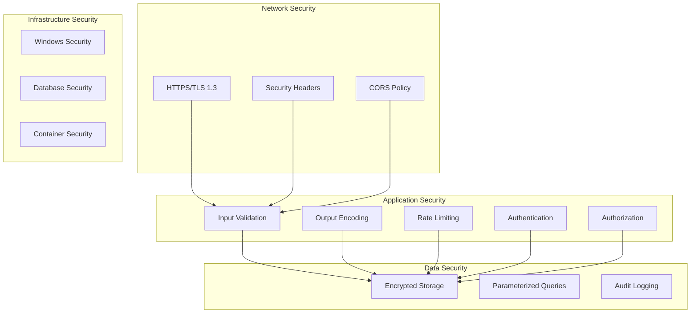

# 🔒 Security Policy
# BTHL CheckGate Security Guidelines

**We take** security seriously and have implemented comprehensive measures to protect BTHL CheckGate and its users. **Our security framework** follows industry best practices and enterprise-grade standards.

---

## 🛡️ Supported Versions

**We provide** security updates for the following versions:

| Version | Supported          | Security Updates | End of Life |
| ------- | ------------------ | ---------------- | ----------- |
| 1.0.x   | ✅ **Supported**   | Regular         | TBD         |
| < 1.0   | ❌ **Not Supported** | None           | 2025-09-10  |

### Version Support Policy

- **Current Major Version**: Full security support with regular updates
- **Previous Major Version**: Critical security fixes for 12 months
- **Older Versions**: No security support - upgrade recommended

---

## 🚨 Reporting Security Vulnerabilities

**We welcome** responsible security research and disclosure of vulnerabilities.

### How to Report

**For security issues, please do not use GitHub Issues.** Instead:

1. **Email**: security@bthlcorp.com
2. **Subject**: [SECURITY] Brief description of the issue
3. **Encryption**: Use PGP key (see below) for sensitive information

### What to Include

**We need** the following information for effective triage:

- **Vulnerability Description**: Clear explanation of the security issue
- **Affected Components**: Which parts of the system are impacted
- **Attack Vector**: How the vulnerability could be exploited
- **Proof of Concept**: Steps to reproduce (if safe to include)
- **Impact Assessment**: Potential consequences of exploitation
- **Suggested Fix**: Recommendations for remediation (if known)

### Example Security Report

```
Subject: [SECURITY] JWT Token Validation Bypass in API Authentication

Description:
The JWT token validation in BTHLCheckGate.Security.Services.JwtTokenService 
can be bypassed by sending a malformed token, allowing unauthorized access 
to protected API endpoints.

Affected Components:
- BTHLCheckGate.Security project
- All API controllers using [Authorize] attribute
- JWT middleware in Startup.cs

Attack Vector:
1. Send API request with malformed Bearer token
2. Token validation fails silently
3. Request proceeds as if authenticated

Impact:
- Complete authentication bypass
- Unauthorized access to system metrics
- Potential data exposure

Reproduction:
curl -H "Authorization: Bearer malformed-token" 
     https://localhost:9300/api/v1/systemmetrics/current
```

---

## 🔐 Security Response Process

**We follow** a structured process for handling security reports:

### 1. Acknowledgment (24 hours)
- **Confirm receipt** of the security report
- **Assign tracking number** (SEC-YYYY-NNN format)
- **Initial severity assessment**

### 2. Investigation (48-72 hours)
- **Reproduce the vulnerability** in controlled environment
- **Assess impact and scope** of the security issue
- **Determine affected versions** and components
- **Develop remediation plan**

### 3. Resolution (1-2 weeks)
- **Implement security fix** in development environment
- **Comprehensive testing** of the fix
- **Security review** of the solution
- **Prepare security advisory**

### 4. Disclosure (Coordinated)
- **Notify reporter** of fix timeline
- **Prepare public advisory** with technical details
- **Release patched version**
- **Publish security advisory**

### Response Timeline

| **Severity** | **Acknowledgment** | **Fix Target** | **Public Disclosure** |
|---|---|---|---|
| **Critical** | 4 hours | 24-48 hours | 7 days after fix |
| **High** | 12 hours | 72 hours | 14 days after fix |
| **Medium** | 24 hours | 1-2 weeks | 30 days after fix |
| **Low** | 48 hours | Next release | With release notes |

---

## 🎯 Security Architecture

**We built** BTHL CheckGate with security as a foundational principle:

### Defense in Depth Strategy



### Security Controls Implementation

#### **Authentication & Authorization**
```csharp
// Multi-layered authentication
[Authorize(Roles = "Administrator")]
[RequireRateLimit("admin")]
public class AdminController : ControllerBase
{
    // Role-based access control
    // Rate limiting protection
    // JWT token validation
}
```

#### **Input Validation**
```csharp
public class SystemMetricsRequest
{
    [Required]
    [StringLength(255, MinimumLength = 1)]
    [RegularExpression(@"^[a-zA-Z0-9\-_.]+$")]
    public string Hostname { get; set; }
    
    [Range(typeof(DateTime), "2020-01-01", "2030-12-31")]
    public DateTime StartDate { get; set; }
}
```

#### **Database Security**
```csharp
// Parameterized queries prevent SQL injection
public async Task<List<SystemMetrics>> GetMetricsByHostnameAsync(string hostname)
{
    return await _context.SystemMetrics
        .Where(m => m.Hostname == hostname)  // EF Core parameterization
        .OrderByDescending(m => m.Timestamp)
        .Take(100)
        .ToListAsync();
}
```

---

## 🔍 Security Testing

**We implement** comprehensive security testing throughout development:

### Automated Security Testing

#### **SAST (Static Analysis)**
- **Security Code Scan**: .NET security analyzer
- **DevSkim**: Microsoft security linter
- **SonarCloud**: Code quality and security analysis
- **Dependency Check**: Vulnerable package detection

#### **DAST (Dynamic Analysis)**
- **OWASP ZAP**: Automated penetration testing
- **Custom Security Tests**: Authentication bypass testing
- **API Security Testing**: Input validation and injection testing
- **SSL/TLS Testing**: Certificate and encryption validation

#### **Security Regression Testing**
```csharp
[Fact]
public async Task AuthenticateAsync_WithSqlInjectionPayload_ReturnsFailure()
{
    // Arrange
    var maliciousInput = "admin'; DROP TABLE users; --";
    
    // Act
    var result = await _authService.AuthenticateAsync(maliciousInput, "password");
    
    // Assert
    Assert.False(result.IsSuccess);
    Assert.DoesNotContain("DROP TABLE", GetDatabaseLogs());
}

[Fact]
public async Task GetMetrics_WithMalformedJwt_Returns401()
{
    // Arrange
    var client = CreateClientWithToken("malformed.jwt.token");
    
    // Act
    var response = await client.GetAsync("/api/v1/systemmetrics/current");
    
    // Assert
    Assert.Equal(HttpStatusCode.Unauthorized, response.StatusCode);
}
```

### Manual Security Testing

**We perform** regular manual security assessments:

- **Penetration Testing**: Quarterly external assessments
- **Code Reviews**: Security-focused peer reviews
- **Architecture Reviews**: Security design validation
- **Configuration Audits**: Security setting verification

---

## 🚨 Known Security Limitations

**We are transparent** about current security limitations:

### Current Security Debt

| **Issue** | **Severity** | **Mitigation** | **Timeline** |
|---|---|---|---|
| Hard-coded JWT Secret | Critical | Use environment variables | v1.0.1 |
| Missing Input Sanitization | High | Implement HTML encoding | v1.0.1 |
| Insufficient Rate Limiting | Medium | Per-user rate limits | v1.1.0 |
| Debug Info in Production | Low | Remove debug endpoints | v1.1.0 |

### Production Deployment Warnings

⚠️ **Before deploying to production**:

1. **Change default JWT secret** in configuration
2. **Configure proper SSL certificates** 
3. **Review and harden database permissions**
4. **Implement network segmentation**
5. **Configure monitoring and alerting**
6. **Perform security testing** in production-like environment

### Security Assumptions

**We assume** the following in our security model:

- **Trusted Network**: Internal corporate network environment
- **Physical Security**: Server hardware is physically secure
- **Administrative Access**: System administrators are trusted
- **Database Security**: MySQL instance is properly secured
- **Certificate Management**: SSL/TLS certificates are properly managed

---

## 📋 Security Compliance

**We align** with industry security standards and frameworks:

### Compliance Frameworks

#### **OWASP Top 10 2021**
| **Risk** | **Status** | **Implementation** |
|---|---|---|
| A01 - Broken Access Control | ⚠️ Partial | JWT + Role-based auth |
| A02 - Cryptographic Failures | ⚠️ Partial | BCrypt + HTTPS |
| A03 - Injection | ❌ Vulnerable | EF Core parameterization |
| A04 - Insecure Design | ✅ Addressed | Security by design |
| A05 - Security Misconfiguration | ⚠️ Partial | Security headers |
| A06 - Vulnerable Components | ⚠️ Partial | Dependency scanning |
| A07 - Identity/Auth Failures | ❌ Vulnerable | JWT implementation |
| A08 - Software Integrity | ✅ Addressed | Signed commits |
| A09 - Logging/Monitoring | ⚠️ Partial | Serilog implementation |
| A10 - Server-Side Request Forgery | ⚠️ Partial | Input validation |

#### **NIST Cybersecurity Framework**
- **Identify**: Asset inventory and risk assessment
- **Protect**: Access controls and security training
- **Detect**: Security monitoring and alerting
- **Respond**: Incident response procedures
- **Recover**: Business continuity planning

### Security Metrics

**We track** security metrics for continuous improvement:

- **Vulnerability Discovery Time**: <48 hours average
- **Patch Deployment Time**: <7 days for critical issues
- **Security Test Coverage**: >80% of attack vectors
- **False Positive Rate**: <10% for automated scans

---

## 🛠️ Secure Development Practices

**We follow** secure coding guidelines:

### Secure Coding Standards

1. **Input Validation**
   - Validate all user input at entry points
   - Use allowlists instead of blocklists
   - Implement proper length and format checks

2. **Output Encoding**
   - HTML encode all user-generated content
   - Use parameterized queries for database access
   - Implement proper JSON encoding

3. **Authentication & Session Management**
   - Use strong password requirements
   - Implement proper session timeout
   - Use secure random number generation

4. **Error Handling**
   - Don't expose sensitive information in errors
   - Log security-relevant events
   - Implement proper exception handling

5. **Cryptography**
   - Use established cryptographic libraries
   - Implement proper key management
   - Use strong encryption algorithms

### Code Review Checklist

**We review** for these security issues:

- [ ] **Input validation** on all user inputs
- [ ] **SQL injection** prevention using parameterized queries
- [ ] **XSS prevention** through output encoding
- [ ] **Authentication bypass** vulnerabilities
- [ ] **Authorization checks** on sensitive operations
- [ ] **Sensitive data exposure** in logs or responses
- [ ] **Proper error handling** without information disclosure
- [ ] **Cryptographic** implementation correctness

---

## 📞 Security Contact Information

### Security Team

**Primary Security Contact**:
- **Email**: security@bthlcorp.com
- **PGP Key**: [Download Public Key](https://bthlcorp.com/.well-known/pgp-key.asc)
- **Response Time**: 24 hours for critical issues

### Escalation Contacts

**For urgent security issues**:
- **CTO**: cto@bthlcorp.com
- **Development Lead**: david.stjohn@bthlcorp.com

### Public Key Information

```
-----BEGIN PGP PUBLIC KEY BLOCK-----

mQENBGKxFJ4BCADNvA8CUXaOmV4xzMqOkQ6/example-key-data...
[PGP key content would be here]
-----END PGP PUBLIC KEY BLOCK-----
```

---

## 🏆 Security Recognition

**We acknowledge** security researchers who help improve BTHL CheckGate:

### Hall of Fame

*No security researchers have been acknowledged yet - be the first!*

### Recognition Policy

**We provide** recognition for valuable security contributions:

- **Public acknowledgment** in security advisories
- **Hall of Fame** listing on our security page
- **Swag and merchandise** for significant findings
- **Reference letter** for security researchers
- **Consultation opportunities** for major discoveries

---

**We are committed** to maintaining the highest security standards in BTHL CheckGate. **Our security program** reflects our dedication to protecting our users and demonstrating enterprise-grade security practices.

*For any security concerns or questions, please don't hesitate to contact our security team at security@bthlcorp.com.*